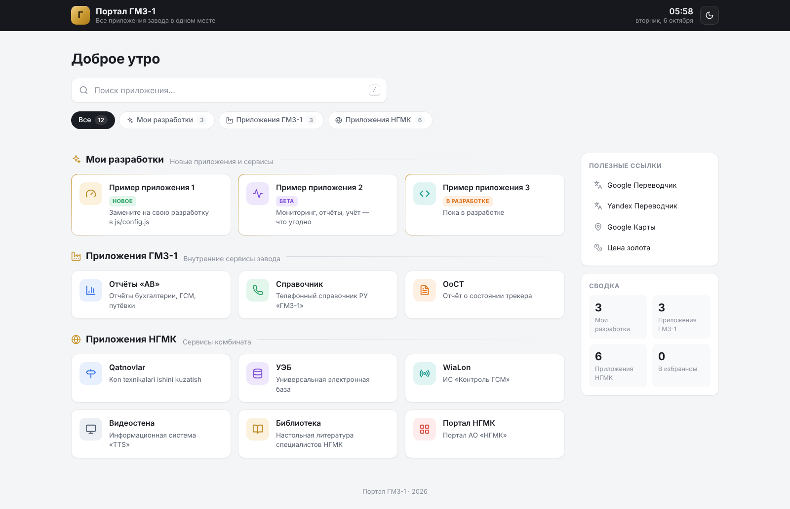

# Портал ГМЗ-1

Стартовая страница со всеми приложениями завода: мои разработки, приложения ГМЗ-1, приложения НГМК и полезные ссылки.



## Возможности

- Поиск по названию, описанию и тегам (клавиша `/` — фокус на поиск, `Enter` — открыть первое найденное, `Esc` — очистить)
- Фильтр по разделам
- Избранное (звёздочка на карточке, сохраняется в браузере)
- Светлая и тёмная тема
- Метки статуса: «Новое», «Бета», «В разработке», «Недоступно»
- Адаптивная вёрстка (компьютер, планшет, телефон)
- Работает **без интернета**: нет внешних библиотек, шрифтов и CDN

## Как добавить своё приложение

Откройте `js/config.js` и добавьте объект в нужный раздел (например, «Мои разработки»):

```js
{
  name: "Учёт реагентов",
  description: "Приход и расход реагентов по цехам",
  url: "http://10.0.0.15:8080",
  icon: "flask",
  color: "green",
  status: "new",
  tags: ["склад", "химия"],
},
```

Список иконок и цветов — в комментарии в начале `js/config.js`.
Новый раздел добавляется так же: скопируйте блок `{ id, title, description, icon, apps: [...] }`.

> У старых приложений сейчас стоит адрес `"#"` — это заглушки, замените их на реальные адреса.

## Запуск

Достаточно открыть `index.html` в браузере. Для доступа всем сотрудникам положите папку
на любой веб-сервер внутренней сети (IIS, nginx, Apache) — сборка не нужна.

```
index.html
css/style.css
js/config.js   ← настройки и список приложений
js/icons.js    ← иконки
js/app.js      ← логика страницы
```
